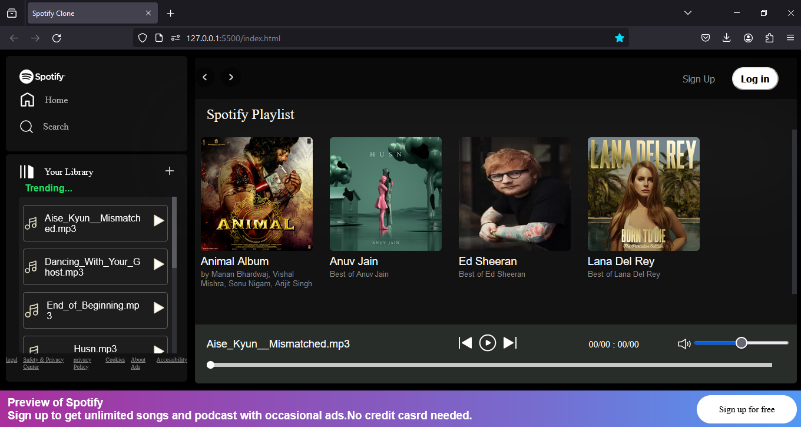
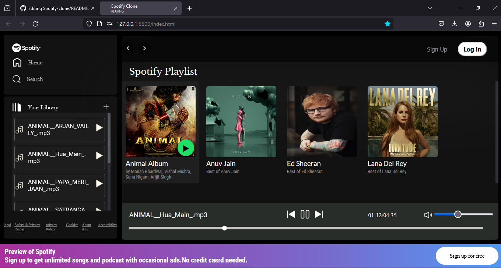

# Spotify Clone

A web-based music player inspired by Spotify, built with HTML, CSS, and JavaScript.

## Features

- 🎵 **Music Playback:** Play, pause, and navigate through your favorite tracks.
- 📄 **Playlist Management:** Create, edit, and delete playlists.
- 🎨 **Responsive Design:** Optimized for both desktop and mobile devices.

## Screenshots


*Home Page*


*Now Playing*

## Installation

1. Clone the repository:
    ```sh
    git clone https://github.com/RonitMurabiya/Spotify-clone.git
    ```

2. Navigate to the project directory:
    ```sh
    cd spotify-clone
    ```

3. Open `index.html` in your preferred web browser and start in live server.

## Usage

- **Browse Music:** Explore songs and albums from the home page.
- **Play Music:** Click on a song to start playing. Use the controls at the bottom to pause, skip, or go back.
- **Create Playlists:** Go to the Music folder and create your own custom playlists.

## Technologies Used

- **HTML5:** For the structure and content of the application.
- **CSS3:** For styling and layout, including responsive design.
- **JavaScript:** For interactivity and dynamic content.

## Contributing

Contributions are welcome! Please follow these steps to contribute:

1. Fork the repository.
2. Create your feature branch (`git checkout -b feature/AmazingFeature`).
3. Commit your changes (`git commit -m 'Add some AmazingFeature'`).
4. Push to the branch (`git push origin feature/AmazingFeature`).
5. Open a pull request.

## Acknowledgements

- Inspired by [Spotify](https://open.spotify.com).
- Icons by [Hugeicons](https://hugeicons.com/).

## Contact

- **Email:** ronitmurabiya1906@gmail.com
- **GitHub:** (https://github.com/RonitMurabiya)

---

Feel free to customize this description to better match your project and personal style. Happy coding!
 
